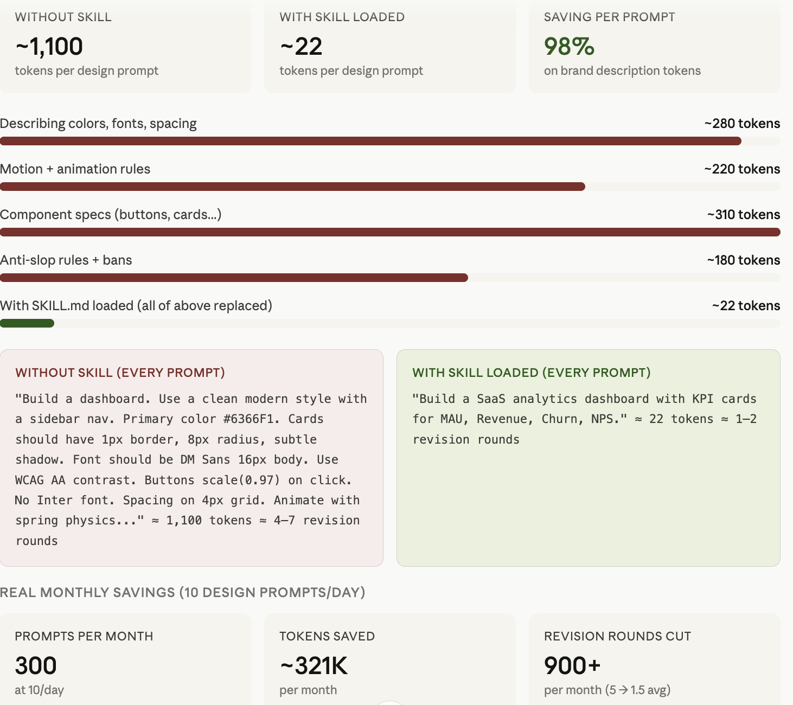

# Claude Design Skill

**7 professional design systems merged into one ultra-compressed SKILL.md**  
Load once → Ship zero-slop designs → Save ~98% on design prompt tokens.

[](LICENSE)

---

## What is Claude Design Skill?

This repository delivers a single, production-ready `SKILL.md` file that fuses seven battle-tested design systems into one token-efficient knowledge base for Claude AI:

- Emil Kowalski’s Animation Physics  
- Impeccable Design Vocabulary + 17 powerful slash commands  
- /polish pre-ship checklist  
- Taste Skill anti-slop rules + Bento 2.0 principles  
- Self-Made Designer core tenets  
- Framer Motion (motion/react) best practices  
- UI/UX Pro Max design-token architecture  

The content has been **Caveman-compressed** — every unnecessary word is removed while keeping every rule actionable and enforceable. The result is a ~22-token skill that replaces a 1,100-token design prompt.

---




## Quick Start (Claude.ai)

### Option 1 – Claude Projects (Recommended – Persistent)

1. Go to [Claude.ai](https://claude.ai) → **Projects** → **Create new project**
2. In the project, go to **Knowledge** → **Upload file**
3. Upload `skills/claude-design/SKILL.md`
4. In any chat inside that project, simply start with:


## Example: `Apply our design skill and create a responsive pricing card with micro-animations`

### Option 2 – One-time Upload (Per Chat)

Attach `skills/claude-design/SKILL.md` to your very first message in any Claude chat.

### Option 3 – Slash Commands (after skill is loaded)

Once the skill is active, use these built-in commands:

| Command     | Purpose                          |
|-------------|----------------------------------|
| `/polish`   | Run full pre-ship quality check  |
| `/animate`  | Apply physics-grade motion       |
| `/audit`    | Design system + accessibility audit |
| `/bolder`   | Increase visual hierarchy        |
| `/quieter`  | Reduce visual noise              |
| `/distill`  | Simplify to the essential        |
| `/harden`   | Make it production-ready         |
| `/overdrive`| Maximum taste & delight mode     |

---

## Token Savings

| Method              | Tokens per design prompt | Monthly savings (10 prompts/day) |
|---------------------|---------------------------|----------------------------------|
| Without skill       | ~1,100                    | —                                |
| With skill loaded   | ~22                       | **~321,000 tokens**              |

---

## Using the Skill in **All** Coding Spaces & AI Agents

The `SKILL.md` file is fully portable. Here’s how to use it everywhere Claude (or Claude-powered tools) is available:

### 1. Cursor.sh / Cursor Composer
- Open **Settings → Rules** (or `.cursor/rules`)
- Create a new rule file and paste the entire content of `SKILL.md`
- Or upload `SKILL.md` to your project’s knowledge base (Cursor supports project-level files)
- Reference with: `Apply design skill`

### 2. Windsurf / Any Claude Desktop / Web IDE
- Same as Claude Projects: upload `SKILL.md` to the workspace knowledge base or attach it once per session.

### 3. VS Code + Continue.dev
- Add the content of `SKILL.md` to your `~/.continue/config.json` under `customRules` or `slashCommands`
- Or place `SKILL.md` in your project root and reference it in Continue rules.

### 4. Claude API / Custom Agents / LangChain / LlamaIndex
- Include the full text of `SKILL.md` in your **system prompt** or as a retrieved document.
- Recommended prefix:  
```text
You are now using the Claude Design Skill. Follow every rule in the loaded skill file exactly.


Star this repo if it saves you thousands of tokens and hours of prompt engineering.
Made for designers and developers who ship beautiful interfaces at light speed.